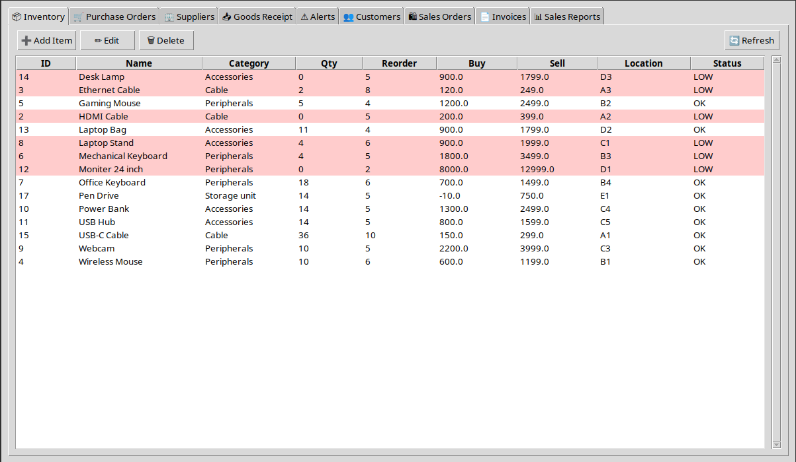
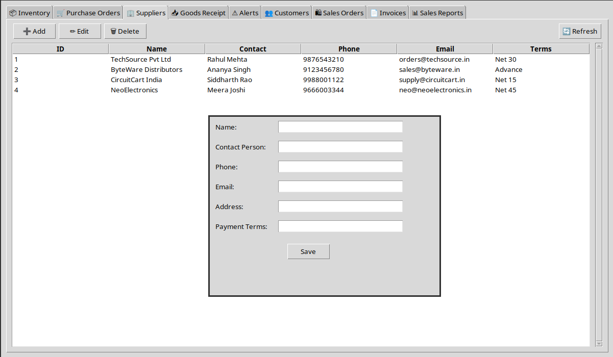
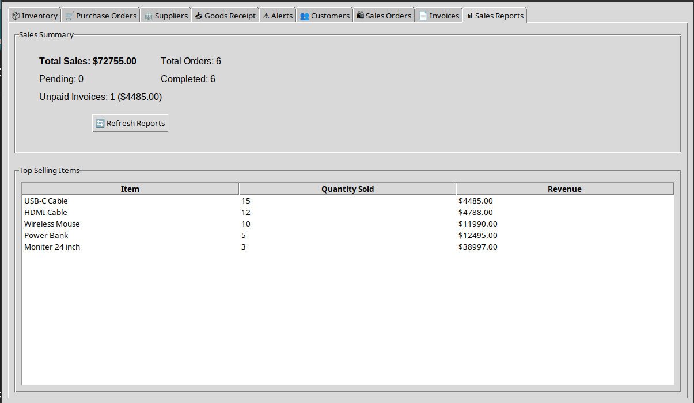
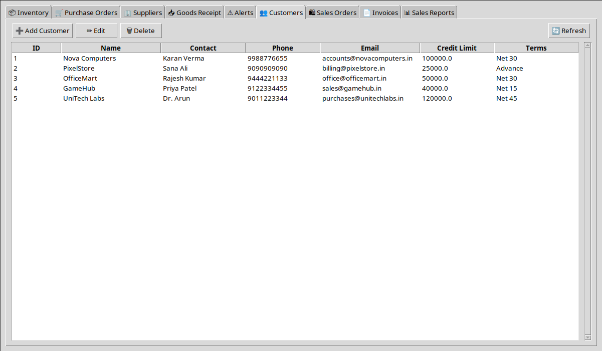
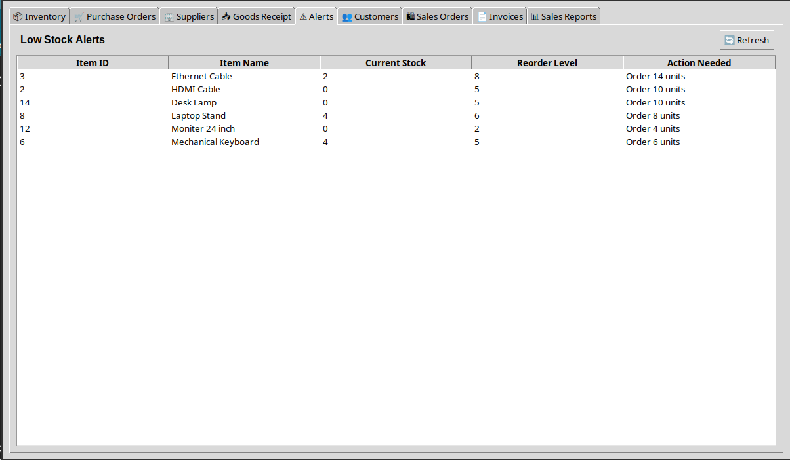

# Inventory Management  
*A College Project — Integrated Purchase & Sales Management System*

---

## 📘 About the Project

**Inventory Management** is a desktop-based application built as a **college project** to demonstrate practical understanding of:

- GUI development  
- Database design  
- Real-world business workflows  
- Modular software architecture  

The application simulates how a small business manages its **inventory, purchases, sales, and billing** using a local database and a graphical interface.

This project is intended for **educational purposes**, not for production or commercial deployment.

---

## 🎯 What This Project Is For

The main objective of this project is to model a **basic ERP-style system** where different departments interact with shared data:

- Purchase Department  
- Sales Department  
- Inventory Control  

It shows how data flows through a system:
**Items → Purchase Orders → Goods Receipt → Inventory → Sales Orders → Invoices → Reports**

---

## 🛠 Technologies Used

- **Python 3**
- **Tkinter / ttk** for GUI
- **SQLite3** for database storage
- Modular Python files for separation of concerns

---

## 📂 Project Structure
```text
inventory-management/
├── main.py # Application entry point
├── database.py # Database setup and table definitions
├── purchase_module.py # Purchase orders & goods receipt logic
├── sales_module.py # Sales, customers, invoices & reports
├── screenshots/
│   ├── AppFinal1.png
│   ├── AppFinal2.png
│   ├── AppFinal3.png
│   ├── AppFinal4.png
│   └── AppFinal5.png
└── README.md 
```
---

## ✅ Features That Are Working

### 🔹 Inventory & Items
- Add, edit, and view inventory items
- Track quantity on hand
- Reorder level alerts for low stock
- Automatic inventory updates from purchases and sales

### 🔹 Supplier Management
- Add, edit, view, and delete suppliers
- Prevent deletion of suppliers linked to purchase orders

### 🔹 Customer Management
- Add, edit, view, and delete customers
- Prevent deletion of customers linked to sales orders

### 🔹 Purchase Orders (PO)
- Create purchase orders for items
- Automatic total amount calculation
- PO status tracking:
  - Pending
  - Partially Received
  - Completed

### 🔹 Goods Receipt
- Receive items fully or partially
- Validate received vs accepted vs rejected quantities
- Update inventory using accepted quantity only
- Track invoice numbers and notes

### 🔹 Sales Orders (SO)
- Create sales orders for customers
- Prevent overselling (cannot sell more than available stock)
- Inventory updates after sales
- Sales order status handling

### 🔹 Invoices
- Generate invoices from sales orders
- Prevent duplicate invoice creation
- Mark invoices as Paid or Unpaid
- View invoice details

### 🔹 Sales Reports
- Total sales value
- Total sales orders
- Completed vs pending orders
- Unpaid invoices count and amount
- Top-selling items

---

## ⚠ Known Issues / Bugs / Unfinished Parts

This project is still incomplete in several areas, which is expected for a college-level system.

### ❌ Single-item Orders Only
- Purchase Orders support only **one item per PO**
- Sales Orders support only **one item per SO**
- Multi-item orders are not implemented yet

### ❌ No Tax / GST Calculation
- Prices do not include GST or any tax
- Invoices show raw totals only

### ❌ Limited Validation
- Some numeric fields may accept negative values
- Empty field validation is incomplete in a few dialogs

### ❌ Item Deletion Safety
- Deleting items that are already used in orders is not fully protected
- This can cause database inconsistencies in some cases

### ❌ UI Limitations
- No scrollbars in some tables
- Layout spacing may feel uneven
- UI styling is basic

### ❌ No User Authentication
- No login system
- No roles (admin/user)

### ❌ No Export Features
- Cannot export invoices or reports to PDF or CSV

---

## ▶ How to Run the Project

1. Make sure **Python 3** is installed
2. Navigate to the project directory
3. Run: python3 main.py


The application will automatically:
- Create the SQLite database
- Initialize all required tables
- Launch the GUI window

---

## 🚀 Possible Future Improvements

- Multi-item Purchase & Sales Orders
- GST / Tax support
- PDF invoice generation
- CSV report export
- Role-based login system
- Better UI/UX
- Stronger data validation
- Dark mode

---

## 📸 Screenshots







---

## 📌 Note

This project was created **strictly for academic learning**.  
It prioritizes clarity, correctness, and workflow understanding over production-grade features.

---

**Author:**  
Mehroom 
Inventory Management System
