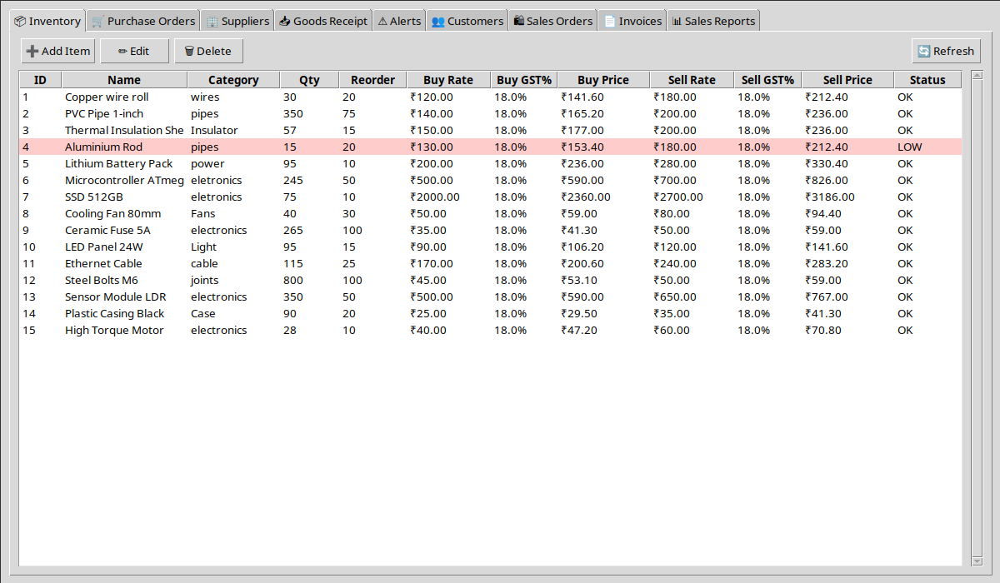
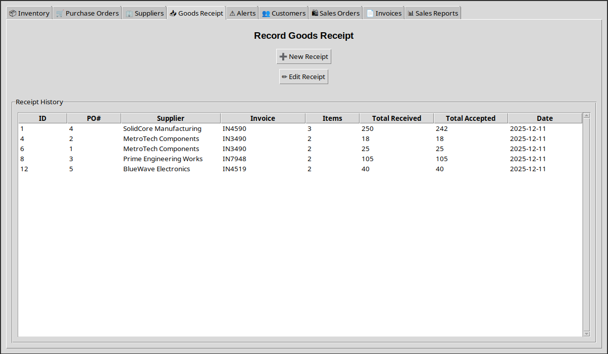
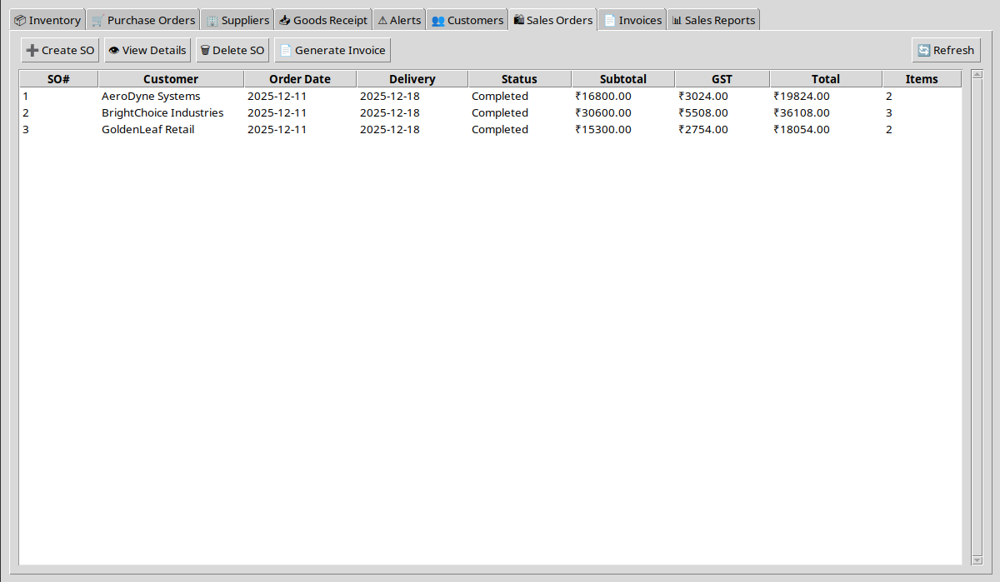
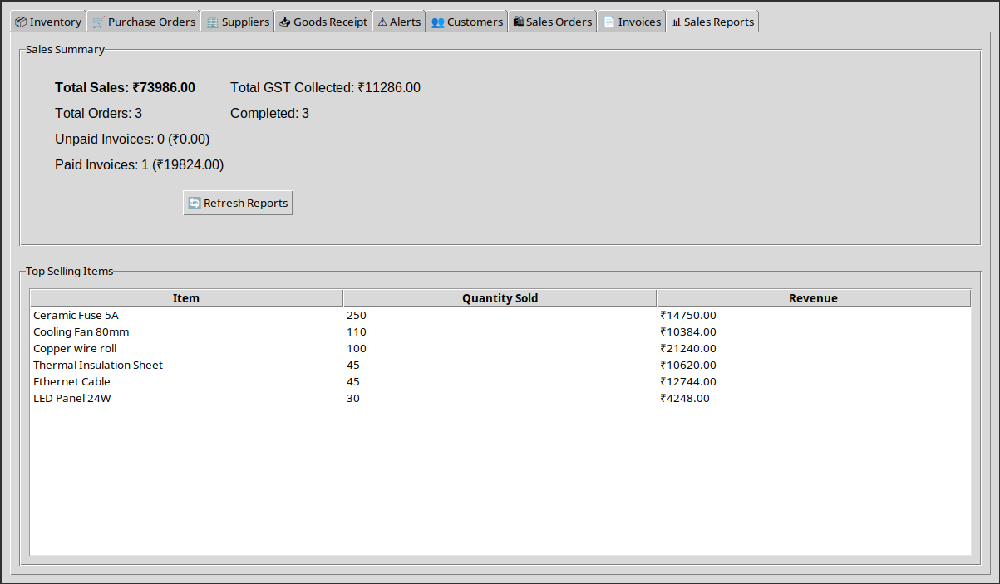
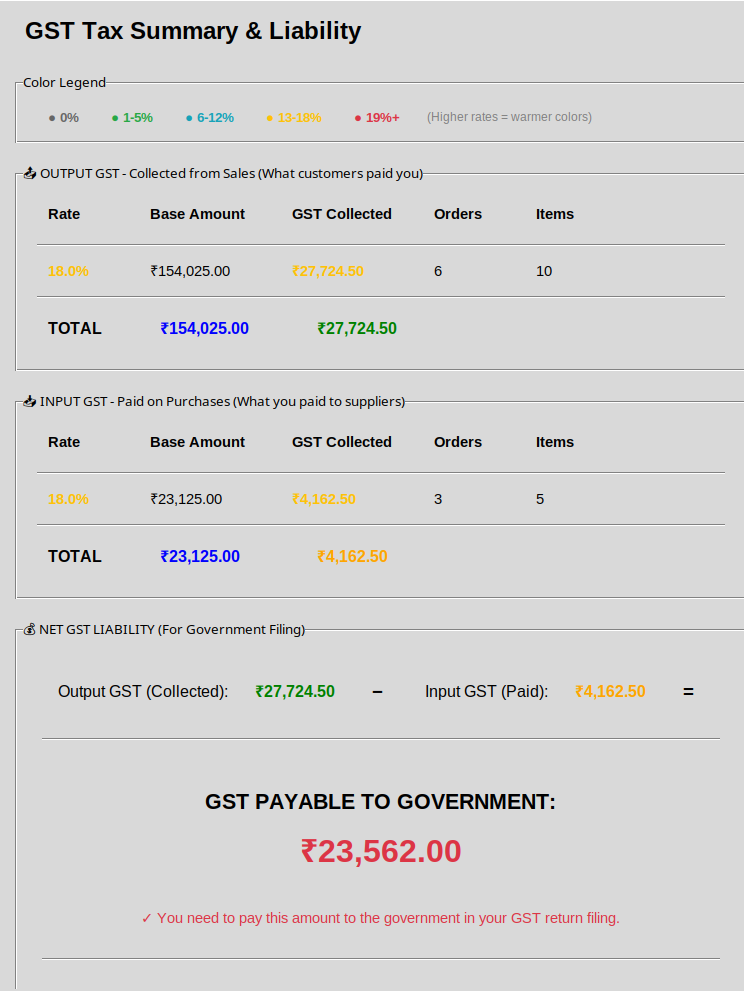

# Inventory & GST-Aware Management System

*A College Project – Integrated Purchase, Sales, and Inventory Workflow*

---

## 📘 About the Project

This project is a **desktop-based inventory management system** developed as a college project to explore how real-world business processes can be modeled in software.

The emphasis is on **correct flow of data and rules**, not on surface-level UI features. The system demonstrates how purchases, inventory, sales, and GST-related values interact internally inside an organization.

Key learning goals include:

* Designing relational databases for transactional systems
* Separating business logic from user interface code
* Modeling real purchase and sales workflows
* Capturing GST data accurately at the transaction level
* Building maintainable, modular Python applications

The project focuses on **how information moves and changes**, and how software enforces consistency when multiple modules share the same data.

---

## 🎯 System Overview

The system models a simplified ERP-style workflow where different operations operate on a shared, consistent source of truth.

Core flow:

**Items → Purchase Orders → Goods Receipt → Inventory → Sales Orders → Invoices → Reports**

Each step has clear rules:

* Inventory increases only when goods are *accepted*
* Inventory decreases only when goods are *sold*
* Orders move through defined states instead of arbitrary edits
* GST values are captured once and stored, not recalculated unpredictably

This mirrors how real accounting and inventory systems prevent silent data corruption.

---

## 🧾 GST Handling Philosophy

This system does **not** file GST returns.

Instead, it focuses on preparing **clean, auditable GST data** that would exist *before* any statutory filing process.

* GST is stored **per item per transaction**
* Purchases generate **Input GST**
* Sales generate **Output GST**
* Reports summarize GST values automatically

Conceptually:

`Net GST Liability = Output GST – Input GST`

The system ensures both sides of this equation are captured transparently and consistently.

All regulatory workflows (returns, portal submissions, validations) are intentionally outside the scope of this project.

---

## 🧠 Architectural Approach

The application is structured around three core layers:

1. **Database Layer**
   Defines tables, relationships, and persistent state using SQLite.

2. **Business Logic Layer**
   Enforces rules such as order states, stock updates, GST calculations, and valid transitions.

3. **UI Layer (Tkinter)**
   Responsible only for user interaction and displaying results, not for deciding business rules.

This separation makes the system easier to reason about, test, and extend.

---

## 🛠 Technologies Used

* **Python 3** – Core programming language
* **Tkinter / ttk** – Desktop GUI framework
* **SQLite3** – Embedded relational database
* Modular Python files for clear separation of concerns

---

## 📂 Project Structure

```text
inventory-management/
├── main.py                 # Application entry point & window manager
├── database.py             # Database schema and initialization
├── purchase_module.py      # Purchase workflows and goods receipt
├── sales_module.py         # Sales workflows, invoicing, and reports
├── screenshots/
│   ├── APPFINAL1.png
│   ├── APPFINAL2.png
│   ├── APPFINAL3.png
│   ├── APPFINAL4.png
│   └── APPFINAL5.png
│   └── APPFINAL6.png
│   └── APPFINAL7.png
└── README.md
```

---

## ▶️ How to Run

1. Install Python 3.7 or newer
2. Navigate to the project directory
3. Run:

```bash
python main.py
```

The database initializes automatically on first run.

---

## 🔄 Example Workflow

1. Add inventory items with purchase and selling details
2. Create suppliers with GST information
3. Raise a purchase order
4. Record goods receipt (accepted and rejected quantities)
5. Create customers with GST details
6. Create sales orders from available inventory
7. Generate invoices from completed sales
8. Update payment status
9. View sales and GST summary reports

Each step updates system state in a controlled and traceable manner.

---

## ⚠️ Known Limitations

### GST Scope

* No CGST / SGST / IGST split
* No place-of-supply logic
* No statutory return formats
* No credit reversal rules

These are regulatory extensions and not the focus of the current design.

### System Scope

* No user authentication or role-based access
* Single-user desktop application
* No export to PDF or Excel
* No external integrations

---

## 📸 Screenshots








